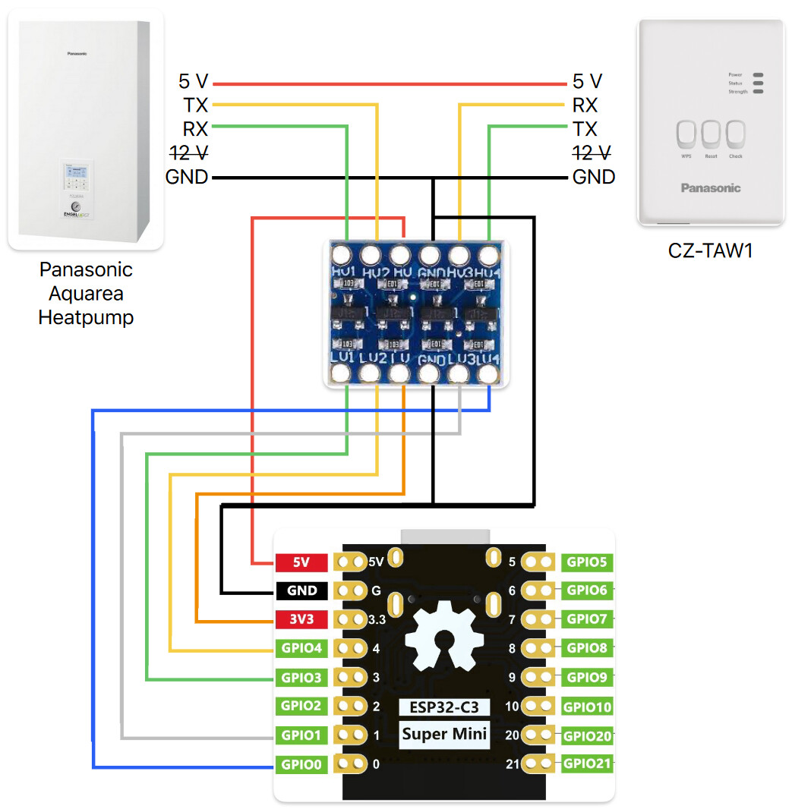

# ESPHome Panasonic Heatpump Component

## Usage

### What you need

* ESPHome compatible microcontroller (e.g. ESP8266, ESP32, ESP32-S2, ESP32-C3, ...)
* Bi-Directional Logic Level Converter (to convert 5V UART signal from the heatpump to 3.3V UART signal of the ESP controller)
* CN-CNT cable to Heatpump/CZ-TAW1 (see [Heishamon](https://github.com/Egyras/HeishaMon) github site for more information)

### Wiring



### CN-CNT Pinout (from top to bottom)

pin | function
----|---------
1   | +5V (250mA)
2   | 0-5V TX (from heatpump)
3   | 0-5V RX (to heatpump)
4   | +12V (250mA)
5   | GND

## ESPHome yaml code

```yaml
substitutions:
  pin_rx_hp: GPIO4  # heatpump reads data (RX) on this pin
  pin_tx_hp: GPIO3  # heatpump sends data (TX) on this pin
  pin_tx_cz: GPIO1  # WiFi module sends data (TX) on this pin
  pin_rx_cz: GPIO0  # WiFi module reads data (RX) on this pin

external_components:
  - source:
      type: git
      url: https://github.com/ElVit/esphome_components/
    components: [ panasonic_heatpump ]

uart:
  - id: uart_heat
    tx_pin: $pin_rx_hp
    rx_pin: $pin_tx_hp
    baud_rate: 9600
    data_bits: 8
    parity: EVEN
    stop_bits: 1
  - id: uart_wifi
    tx_pin: $pin_rx_cz
    rx_pin: $pin_tx_cz
    baud_rate: 9600
    data_bits: 8
    parity: EVEN
    stop_bits: 1

panasonic_heatpump:
  uart_hp: uart_heat
  uart_wm: uart_wifi

sensor:
  - platform: panasonic_heatpump
    top1:
      name: "Pump Flow"
    ...

binary_sensor:
  - platform: panasonic_heatpump
    top0:
      name: "Heatpump State"
    ...

text_sensor:
  - platform: panasonic_heatpump
    top4:
      name: "Operating Mode State"
    ...
```

## Sources

:heart: A big THANKS to [Egyras](https://github.com/Egyras) and the work done on the repository [HeishaMon](https://github.com/Egyras/HeishaMon) for decoding the panasonic uart protocol and providing information to build hardware based on an ESP Chip.  
:heart: Thanks to the whole home assistant community for sharing their knowlege and helping me to create this ESPHome component!  
